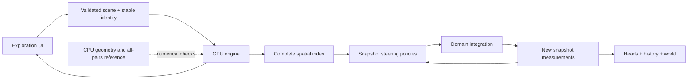

# Swarm3D architecture

Swarm3D is an interactive flocking laboratory. Its domains are a three-dimensional box volume and the two-dimensional surfaces of a sphere, plane, open cylinder and torus. A visible 3D shape does not determine the physics: agents inside a ball and agents constrained to its surface have different degrees of freedom, distances and density units.

This document records the implemented model and runtime contracts. It also marks the limits that must be resolved before adding further surfaces or making research claims. AI decision policies and a full experiment suite are future work.

## Ownership and interfaces

- `src/lib/model/` is ordinary TypeScript, independent of Svelte and GPU availability. It owns versioned scene definitions, validation, stable identity, seeded initialization/discovery, response curves, metric metadata, CPU geometric/reference measurements and local scene storage. Import its public barrel as `#lib/model`.
- `src/lib/gpu/` owns GPU packing, shaders, camera/input and the live simulation. `shaders/layout.md` is the concrete packed-buffer contract. Numeric metric slots and behavior order must match the model registry and `BEHAVIORS`.
- Svelte components own presentation and reversible interaction state. They submit complete validated scene changes, track selection by agent ID, and maintain UI undo history. They do not redefine distances or metric formulas.
- vgpu supplies the GPU lifecycle, resolved shader modules, buffers and rendering. The application owns the mathematical pass graph. Its compute runtime uses the public native device/buffer handles to encode one coherent compute submission per physical tick; rendering remains a vgpu frame. That batching stays behind the engine boundary and preserves phase causality.

## Scene and run state

`SceneDefinition.version` is exactly `1`. The new format has no legacy import path. A scene contains its ID/name/description, uint32 seed, domain, stable species keys, populations and physical/visual parameters, directed rules, metric rules, obstacles, force-placement settings, camera and dynamics. It contains definitions rather than an implicit viewport-dependent world.

The prerelease version-one format accepts a missing species `cruiseSpeed` by normalizing it to `0.3·speed`, and missing `visual.quality` to `balanced`. Validation returns a fresh complete scene without mutating the input, and later JSON/share/storage writes include those explicit values. Present invalid values are rejected rather than defaulted or clamped. This compatibility is for Swarm3D's own prerelease format; it does not import old Swarm scenes.

Distances are world units, speed is units/second, acceleration is units/second². Body size is a collision radius; a visual head tip can extend beyond that radius. Trail length is seconds. Camera orbit/pan/zoom and a viewport resize do not change physical world dimensions.

Visual quality is a presentation setting. `fast` caps the offscreen stage at one pixel per CSS pixel, `balanced` at 1.25, and `sharp` uses native device pixel ratio capped at two. Canvas presentation retains native resolution up to that same cap in all three modes. Changing quality does not change population, rules, world size or the integration timestep. It affects render detail and cost; simulated-time throughput remains separately reported.

Every species has independent alignment/cohesion/separation, perception, maximum speed, cruise speed, force, rebel timing, cursor response/vortex, body shape, size, trail and base HSL. Each H/S/L channel has its own enabled flag, metric source, physical normalization range, strength and editable curve. An editor being visible is separate from a mapping being enabled.

Choosing a metric source activates its mapping; choosing Species uses the base channel. The interface exposes base values for Species, disabled mappings and partial-strength blends. Constant sources do not present ignored strength or curve controls. Synchronous configuration commits continue into rendering and the next tick without clearing fractional timestep accrual; only structural migration or reset suspends the clock. Continuous appearance edits therefore repaint while paused and do not starve physical ticks while running.

New scenes, curated scenes and discoveries include an explicit `All others` Flee fallback for each species, with strength one and a null radius that follows its perception. Adding a species creates that rule only for the new source, preserving existing edits. These are ordinary editable scene rules, not a hidden solver default: specific targets override them, wildcard rules exclude the source species, and saved/imported configurations keep their declared rules.

Baseline alignment/cohesion use cubic distance weights within the same species. Alignment matches the weighted mean velocity; cohesion uses the bounded mean displacement directly. It does not command full speed toward an arbitrarily small centroid displacement. Same-species separation uses a squared close-range falloff within `max(2·size, perception/4)`. All-agent soft collision uses linear overlap falloff within the sum of radii times the collision multiplier, separately from directed steering. Force components and the total acceleration are bounded by the configured force limits.

Species `speed` is a maximum. Independent `cruiseSpeed`, in units/second, is a bounded active-propulsion target with `0 ≤ cruiseSpeed ≤ speed`. New species and the base scene use `0.6·speed`: Jade has maximum speed 9.6 units/s and cruise target 5.76, while Amber has maximum 10.8 and target 6.48. Both have an acceleration limit of 14.4 units/s². Discovery samples targets between `0.5·speed` and `0.75·speed`; Ring Currents uses `0.65·speed`. These authored defaults differ from the retained `0.3·speed` compatibility value for missing prerelease fields.

Steering first forms a candidate velocity within the maximum-speed cap. When its magnitude is below the cruise target, use its heading, then the old heading, then a seeded direction if stationary. Every surface fallback direction lies in the current tangent plane. Form the target velocity in that heading and limit `target − oldVelocity` to `force·dt` before adding it to old velocity; retain the maximum-speed cap. This uses the existing acceleration budget rather than adding an unbounded minimum-speed jump. Zero force cannot accelerate, and a transient below cruise is valid. Zero cruise disables this active propulsion. The target is not guaranteed after obstacles, contacts or one tick from rest.

Without active propulsion, random initial headings can lose magnitude through velocity matching, and spring/separation/contact equilibria can settle toward rest. Slow stored velocity at a simulation/wall-time ratio near one is physical model behavior, distinct from scheduler overload. Noise is a seeded acceleration sampled each physical tick; its amplitude is not specified as a timestep-independent continuous-time diffusion coefficient.

Overlapping bodies additionally receive one Jacobi-style positional correction from the immutable input snapshot: mean half-overlap displacement, bounded by `min(size/2, maxSpeed·dt/2)`. Total movement is capped at `maxSpeed·dt`. Surface corrections use the domain exponential map and transport both current and previous steering velocity into the new tangent plane. This is a bounded contact constraint, not an elastic collision solver or a guarantee that every dense overlap disappears in one tick. It does not add a minimum-speed floor or inject a velocity boost. The soft collision coefficient does not disable this distinct positional constraint. Coincident pair directions are seeded, finite, tangent when necessary, and antisymmetric by stable ID.

`AgentState` uses world position and physical velocity. Sphere positions have length `R`; cylinder positions satisfy `x²+z²=R²` within bounded axial height; plane positions have `y=0`; torus positions satisfy `(hypot(x,z)−R)²+y²=r²`. Every surface velocity is tangent. An agent has a stable integer ID, species key and birth ordinal. `PopulationState.generation` distinguishes resets; `nextId` prevents ID reuse within a run.

The stored velocity is the steering/integration velocity. Contact and obstacle positional constraints can alter actual displacement without assigning that correction as stored velocity. Reported speed, turn and acceleration measure this stored velocity; they are not finite differences of constrained positions. ID allocation fails with a new-run instruction before exhausting its uint32 capacity, rather than wrapping and aliasing an existing individual.

Population edits preserve surviving agents and their physical state. Growth creates new IDs; shrinkage removes the largest birth ordinals deterministically within each species. Storage reordering does not change identity. Exact largest-remainder allocation preserves the requested total, with stable species-key tie order. A selected agent that disappears must clear selection, not silently select another storage slot.

Structural GPU edits read back current particles, metrics and bounded position/color history, then remap them by stable ID. Survivors retain position, current velocity, transported previous velocity and their temporal metric state. Newly allocated slots start at their seeded positions, with previous velocity equal to current velocity and a metric sentinel that initializes their first complete observation rather than blending it with zero. A reconciliation bootstrap uses smoothing weight zero for survivor temporal fields; instantaneous speed/count/density still refresh. Newborns initialize normally. This preserves the existing observation/filter state instead of adding an extra smoothing step during an edit.

Each metric record is 64 bytes: fifteen measurements and one padding float. Each bounded history sample occupies 32 bytes in a structure-of-arrays allocation: a prefix of `vec4(position.xyz, generation)` followed by a suffix of `vec4(linearRGB, valid)`. There are 64 samples per allocated agent slot. Config row 15 `.z` is the color suffix offset, `capacity·64` in vec4 entries, rather than an offset based on the current population. Allocation growth and compaction must remap both blocks with that capacity contract.

History sampling writes position and appearance from the same completed particle/metric snapshot. The head receives the current linear RGB after initial measurement and after structural reconciliation. Newborn position slots are initialized at their spawn point; their older color validity starts at zero, with the shader using current color as a finite fallback until samples are recorded. Older valid colors are retained when species HSL, mapping curves or palette settings change. The unsampled segment between the current head and newest stored point interpolates the current appearance toward that stored color; older segments interpolate their own recorded endpoint colors. Opacity, width and physical-age fading still use current trail settings.

History migration receives `headElapsed`, the physical seconds since the newest old sample. The new head anchors at the preserved current position. Older target ages interpolate between current and the old newest sample when they fall within that gap, then between adjacent old history samples using their actual ages. Valid coverage is `floor(((valid−1)·oldInterval + headElapsed)/newInterval)+1`, capped at 64. Historical colors use those same target physical ages and interpolate linearly between adjacent old RGB/valid records; ages inside the unsampled gap retain the old newest color, and the reconciliation measurement refreshes the new current head. Sphere chord interpolants project onto radius `R`; cylinder interpolants follow the shortest circular chart displacement and linear axial displacement; torus interpolants wrap both native angles along their shortest signed displacement; periodic-plane and periodic-volume interpolants use a minimum-image displacement and wrap back into the domain. This is a bounded positional interpolation, not a reconstruction of unsampled turns or multiple wraps. Discontinuity tokens are never blended. Callers omitting phase retain the earlier nearest-sample compatibility behavior for positions.

After structural migration, rebase the sampling phase at the new current-position head. Track elapsed physical time since the last sample and an elapsed tick counter independently of absolute `tick % stride`; resetting or changing the interval must not pretend the old newest sample occurred at a new phase. Config row 15 carries elapsed history seconds in `.x` and an explicit sample flag in `.y`. History writing uses that flag, and trail age uses elapsed seconds. Thus rendering and sampling share the same phase even after timestep/stride changes.

Config row 14 carries tick, full seed, run generation and selected stable ID as raw uint32 words, read through WGSL bitcasts. The authoritative seed/random tick path does not convert those integers through float32, so high bits and increments above `2²⁴` survive. Shader tick hashing uses the uint32 tick modulo `2³²`; this is distinct from the separate physical-time clock. Stable IDs are reserved before that boundary and never wrap into an existing individual. Full-state checkpoints and long-run epoch/clock precision remain later research work.

A reset or incompatible domain change starts a new physical run. Future policy memory must be associated with identity, and any directional memory must use the domain's transport rules. This boundary supports later agent minds without adding an AI implementation now.

## Tick causality

The simulation starts by creating state zero, building its spatial index and measuring its initial metrics. Each physical tick then follows:

1. Commit pending scene changes and freeze one configuration for the tick. Refresh caches invalidated by population, geometry, perception or measurement-definition edits.
2. Read immutable `state[n]` and `metrics[n]`. Policies accumulate forces and integration writes `state[n+1]` to a distinct buffer.
3. Build the index for `state[n+1]` using clear/count/prefix/scatter passes.
4. Read that complete state/index and previous metrics to write `metrics[n+1]` to a distinct buffer.
5. Write position and linear RGB history from `state[n+1]` and `metrics[n+1]` when its simulation-time sampling stride is due. The completed index/measurements feed the next tick.

Every simulation substep needs its own completed measurements. Rendering happens once per display frame using the latest completed snapshot. No pass may read neighbors' measurements while it writes those same measurements, or query output positions with an index built from input positions.

Each tick queues one configuration snapshot immediately before its compute submission. Simulation, complete index reconstruction, measurement and optional history writing share that snapshot. Sequential dispatches use separate read/write state and metric buffers, then CPU side selectors advance. Reusing a CPU configuration array is safe because buffer writes enqueue a byte copy before the submission. A later multi-tick encoder cannot queue several writes to one configuration buffer and assume each dispatch sees a different value; it needs distinct snapshots or offsets.

The default integration step is `1/60` second, with a maximum of four ticks per display frame. `timeScale` changes the tick budget; it does not enlarge the integration step. The scheduler bounds accumulated wall-time work, and the simulation clock advances only for executed ticks. The displayed real-time factor is executed physical simulation seconds divided by elapsed wall seconds. Its intended target is `timeScale`, normally one; a lower ratio indicates overload or scheduling loss, not merely smaller boid velocities. Pause/background/resume must reset scheduling accrual.

Temporal filters advance once per physical tick. Remeasuring an edited snapshot at the same tick must not advance a filter twice. A changed metric definition either invalidates its filter or needs recomputation from its previous-tick value.

## Complete neighborhoods

The count/scan/scatter index allocates a slot for every active agent. Queries inspect all candidates in all intersecting cells. There is no 32/64-neighbor truncation and no fixed cell occupancy capacity. Query reach includes the applicable perception, separation, soft collision, positional contact and directed/metric-rule ranges. Turning off soft collision does not remove the contact radius from coverage. An explicit Ignore rule overrides a wildcard fallback regardless of array order. A null rule radius means source-species perception.

Periodic volume queries deduplicate wrapped cells and use a minimum-image displacement. A periodic volume is a three-dimensional quotient, distinct from the donut-shaped torus surface's curved metric. Its rendered trails need boundary splitting/wrapping rather than a long line across the box.

Sphere, cylinder and torus broad-phase cells use ambient coordinates; final queries use intrinsic distance and tangent displacement. Plane cells use the XZ chart with one Y layer; periodic-plane cells deduplicate wrapped X/Z representatives. Chord distance can conservatively reject distant candidates, but cannot replace the final intrinsic range test; the torus uses its declared midpoint classifier. A neighbor's velocity is transported into the observing tangent plane before alignment or measurement.

Complete queries retain a quadratic worst case when all agents share a neighborhood. The desktop 5k–20k bracket is a benchmark target, not a guarantee for every radius or clustered distribution. The initial population is 5,000; increasing the default requires measured performance on a stated adapter and representative scene/trail settings.

Atomic scatter can change floating-point summation order. The seed and stable IDs guarantee initialization and random streams; they do not promise bitwise replay of a chaotic trajectory. Short-window CPU/GPU agreement uses documented tolerances. A later deterministic research mode needs a stable reduction order and a scoped runtime/hardware guarantee.

## Sphere geometry and behavior limits

Sphere neighborhood distance, logarithm, exponential stepping and parallel transport have analytic definitions. They avoid latitude/longitude simulation poles. Endpoint-to-endpoint transport is ambiguous at antipodes, so interaction ranges and per-tick travel are constrained below `πR/2`. The standalone CPU stepping helper can transport along its chosen arc even at an antipodal endpoint. [Geomstats' primary implementation](https://geomstats.github.io/_modules/geomstats/geometry/hypersphere.html) provides an independent analytic reference.

Free motion follows a great circle with preserved physical speed. True steering turn and acceleration compare previous and current velocities after transport; bending around a sphere is not counted as steering. Outward normal provides surface handedness. Volume orbit/vortex uses the configured axis, initially world Y; tangential force vanishes on the axis.

The twelve behavior names define steering policies, not identical equations across dimensions. Current Chase/Follow use local displacement and transported target velocity for tangent-space lead/behind-slot steering. They are explicit local policies, not claims of exact future target-geodesic prediction. Any later predictor that uses target exponential motion must be versioned as a behavioral change.

Directed Align matches the target's actual transported velocity, capped to the source speed limit; Mirror matches its negative. Neither normalizes a slow or stationary target into a full-speed command. Spiral's circulation sign is fixed for the source/target species pair by species-index parity, with the local surface normal or volume orbit axis defining handedness. It is not independently randomized per neighboring individual.

Directed responses accumulate in separate target-species buckets. Ordinary behaviors average only their participating target neighbors before the behavior-specific cap; unrelated species and inactive rules cannot dilute that response. Flee and Scatter retain additive urgency across threats, bounded to four and five times the species force limit respectively before the shared final acceleration cap. Each metric rule has its own active-neighbor bucket. Disabled, Ignore, zero-strength and zero-activation contributions are excluded from their denominators; active metric forces are averaged within that rule before the shared acceleration limit.

Surface obstacles are intrinsic disks centered on the selected surface: geodesic caps on the sphere, flat disks on the plane and circular disks in the cylinder chart. Sphere radii stay below `πR/2`, cylinder radii below `πR`. The serialized primitive remains `shape: 'sphere'` for prerelease format compatibility; the interface labels surface primitives Disk. A compound ring consists of sixteen intrinsic disks. Ring centers use the domain exponential map; circles clamp at bounded edges and wrap across periodic seams. Surface box primitives are rejected. Volume obstacles can be spheres or boxes. Cursor placement is `dot(point, workPlane.normal) = workPlane.offset + forces.depth`; depth is a placement offset, not field thickness. Volume field thickness is a runtime geometric parameter derived from radius. All surface fields use intrinsic range and actual ray hits; the cylinder has no pickable end caps. Surface forces do not use the volume work plane or depth offset.

## Measurement contract

All neighborhood statistics use every species within the observer's perception. Snapshot statistics are unweighted; baseline flocking can use its own distance weighting. Empty neighborhoods return finite zero aggregate values. Density is not boundary-corrected.

The packed metric record contains four `vec4f` rows, 64 bytes total. Fifteen fields use this exact order; slot 15 is padding:

| Slot | ID                    | Definition and units                                                                                                       | Temporal behavior  |
| ---- | --------------------- | -------------------------------------------------------------------------------------------------------------------------- | ------------------ |
| 0    | `speed`               | Physical velocity magnitude, units/s                                                                                       | Instant            |
| 1    | `turn-rate`           | Transport-corrected heading change / dt, rad/s; zero without moving history                                                | Smoothed           |
| 2    | `acceleration`        | Magnitude of transport-corrected velocity difference / dt, units/s²                                                        | Smoothed           |
| 3    | `neighbor-count`      | Number of other perceived agents                                                                                           | Instant            |
| 4    | `density`             | Count / nominal neighborhood measure: volume ball, sphere cap or flat-chart disk                                           | Instant            |
| 5    | `anisotropy`          | `(d·λmax/trace−1)/(d−1)` for displacement second moments; d=3 volume, d=2 surface                                          | Smoothed           |
| 6    | `polarization`        | Length of mean unit transported neighbor velocity                                                                          | Smoothed           |
| 7    | `radial-flow`         | Mean dot of unit relative velocity with unit displacement; positive separating                                             | Smoothed           |
| 8    | `heading-azimuth`     | World X/−Z velocity bearing in turns; zero for vertical/stationary velocity                                                | Smoothed, circular |
| 9    | `center-distance`     | Length of mean intrinsic displacement, units                                                                               | Smoothed           |
| 10   | `center-bearing`      | Bearing of mean displacement in local oriented frame, turns                                                                | Smoothed, circular |
| 11   | `flow-orbit`          | Bearing of mean transported neighbor velocity in local frame, turns                                                        | Smoothed, circular |
| 12   | `center-orbit-angle`  | Unsigned center-relative velocity phase around the surface normal or volume orbit axis, turns                              | Smoothed, circular |
| 13   | `center-radial-speed` | Velocity component toward the mean neighborhood displacement, units/s; positive inward                                     | Smoothed           |
| 14   | `speed-contrast`      | Absolute difference between own speed and magnitude of mean transported neighbor velocity, divided by source maximum speed | Smoothed           |
| 15   | Padding               | Reserved, zero in newly measured records                                                                                   | —                  |

`center-orbit-angle` projects velocity and the outward center direction onto the plane normal to the configured axis. Its unsigned phase is `fract(atan2(dot(cross(v,outward),axis), dot(v,outward))/2π + 0.5)`: inward is phase zero, outward is one half, and the two tangential senses have quarter-turn phases. It is a circular quantity, not a signed radial speed or a world heading. It returns zero without neighbors or either projected direction. `center-radial-speed` uses the unprojected intrinsic center direction and returns zero for a zero center displacement. `speed-contrast` compares against the magnitude of the mean velocity vector, not the mean of individual speed magnitudes; oppositely moving neighbors can cancel that mean. All three are zero for an empty neighborhood before temporal smoothing.

Anisotropy is zero for isotropic neighborhoods, one for a line and 0.25 for a uniform 3D sheet. It is a local shape statistic, not a global flock classification. Density estimates a local agent density rather than measuring continuous matter. Nominal neighborhood measure is `4πr³/3` in the box, `2πR²(1−cos(r/R))` on the sphere and `πr²` on the plane/cylinder/torus. The torus's nominal disk estimate is not curvature-corrected. Reflecting edges, cylinder ends and large wrapped-plane disks are not area-corrected. Finite-difference acceleration/turn and the remaining neighborhood statistics are labeled local estimates in the registry. World heading's explicit reference is not rotation invariant. Sphere local bearings reference world Y with a pole fallback; this visual/rule reference has a coordinate discontinuity even though sphere motion itself has no UV pole.

Metric rule roles are Neighbor, Self and absolute Difference. Circular differences use the shorter distance on the unit circle. A rule normalizes through its own range and response curve. Display maps have independent ranges/curves and consume the same documented measurements.

Smoothed scalar values use `alpha = 1−exp(−dt/smoothingSeconds)`. A zero smoothing duration means raw values. Circular values interpolate along the shortest arc; exact half-turn ties preserve the sign of the difference. Speed, count and density remain raw. Bootstrap uses raw measurements rather than stale history.

The CPU reference is `measureAllPairs`; a complete grid query can be injected to verify indexed measurements. `smoothMetrics` defaults to weight one, so raw CPU/GPU comparisons are explicit. Geometry tests cover inverse maps, tangent/norm preservation, chosen antipodal step arcs, great-circle motion, cell completeness, periodic ties and more than 64 colocated agents.

## Curves, validation and storage

Five palettes and all nine inherited response presets remain available. Linear, S-curve, BoostLow, BoostHigh, Inverted, ExpRise, ExpDecay, Bowl and Bell preserve their legacy control points. Bowl/Bell have interior extrema. Fritsch–Carlson interpolation is shape-preserving within each interval; the entire curve need not be globally monotone. CPU cubic curves are sampled into 32-point GPU tables with linear lookup, so shader evaluations are an approximation to the editable cubic.

Appearance mappings blend each base H/S/L channel linearly toward its normalized curve output by the enabled strength, including hue. Circular metric differences and temporal filters remain circular; hue mapping strength does not take a shortest-color-wheel shortcut. Static species HSL bypasses the selected palette ramp unless hue has an enabled nonconstant metric mapping with positive strength. Rainbow uses ordinary HSL; inherited ramp palettes then apply saturation and brightness scaling. The resulting sRGB is converted to linear RGB for lighting, history and HDR compositing.

Bodies use geometric normals normalized after interpolation, a directional key and fill, a colored rim and hue-preserving specular highlight. Selected bodies receive a separate visible accent. Trails use their recorded linear RGB with a luminous center and soft shoulders. Surface meshes write depth with their color write mask disabled: they hide far-side agents while retaining the chosen background. Sparse wire guides are explicitly controlled by `showBoundary`, which defaults off. Enabling guides draws the physical box edges or sparse sphere/plane/cylinder/torus coordinate lines; the depth-only surface remains active either way. Volume Force and Obstacle tools expose their placement plane independently of this guide switch. These lighting and presentation choices do not alter positions or physical rules.

`validateScene` returns issues with paths; `assertScene`/`parseScene` throw on invalid definitions. Validation rejects unknown properties, nonfinite numbers, malformed curves, duplicate/dangling references, unsupported versions, unsafe sphere/cylinder/torus shapes or ranges or per-tick travel and incompatible surface obstacles. Limits bound population, species, rules, primitives and file size; they are format/resource limits rather than a promise of real-time performance.

IndexedDB is opened lazily under `swarm3d-scenes`, version one. A save transaction preserves creation time and commits a complete validated definition plus optional thumbnail. Delete returns the removed record only after commit. UI Undo calls `restore`; restoration refuses to overwrite a record recreated under the same ID. Storage failures do not silently fall back to volatile memory. The explicit memory adapter is for tests.

JSON import/export and URL-safe UTF-8 scene shares validate the same version-one format. The 256 KiB limit applies before parsing. These serialize scene definitions, not simulation checkpoints or experiment results. Unicode names round-trip. A saved scene's thumbnail is separate local metadata, not executable or remote content.

## Plane and cylinder geometry

The plane is the XZ rectangle at Y zero. Its physical half-extents are `[hx,hz]`, with reflecting or periodic edges. Periodic displacement uses the minimum image independently in X and Z; exact half-period ties retain antisymmetry. Translation transports tangent vectors identically. Free motion reflects at finite edges or wraps, without changing physical speed. Multiple crossings in a tick use the full reflected or periodic coordinate transition.

The open cylinder is `p=(R cos θ,y,R sin θ)` with `−H ≤ y ≤ H`. In the exact flat chart `(Rθ,y)`, displacement combines the shortest signed circular arc and axial difference. A neighbor's azimuthal and axial velocity components are transported into the observer's tangent frame. Free motion advances θ by `vθ·dt/R`, reflects the axial component at bounded ends and preserves physical speed. Rotation around the shell does not count as steering turn. All interaction ranges and per-tick travel stay strictly below `πR`; this avoids ambiguous half-circumference local relations and history.

Physical measure is `4hx hz` for a plane and `4πRH` for the cylinder. Initialization is uniform in X/Z or θ/Y respectively. Both are exact intrinsic metrics; displaying a curved cylinder does not replace arc length with ambient chord length. Surfaces use the outward normal for local circulation (the plane uses +Y). The cylinder's circular seam is geometrically smooth; reflecting ends have a physical boundary.

Painting and erasing use the same intrinsic geometry as force/neighborhood queries. Plane disks can cross periodic edges; cylinder disks can cross the circular seam. Bodies use transported tangent orientation and world-space history follows the surface. Periodic-plane trails split at visible edges. Shape/dimension edits reset the run and fit framing after the pending geometry is committed; scene load and Undo retain authored framing. UI inspection reports normalized plane X/Z or cylinder azimuth/height coordinates, independently of its measured world position.

The Stage 3A production browser checks cover physical picking and force response, dimension edits with fitted framing, paused capture, disk/ring painting and erase, and saved/imported scene round-trips for both new surfaces. Native `scripts/gpu-surfaces.mjs` now defines comparisons for all fifteen measurements with CPU all-pairs references in ordinary/dense/seam cases, alongside chart motion, transport, directed behaviors, contact/range coverage, obstacle/field behavior and real depth-tested body/history rendering. Existing box/sphere regressions remain required. The earlier successful Stage 3A verification predates the current metric/history/rendering changes; these source-defined checks must be rerun after changes and do not establish the correctness of later curved chart surfaces.

## Torus geometry and declared approximation

The torus definition is `{kind: 'surface', shape: 'torus', majorRadius: R, tubeRadius: r}`. Its immersion is `p=((R+r cos θ) cos φ, r sin θ, (R+r cos θ) sin φ)`: θ goes around the tube, φ around the main ring. The induced metric is `ds²=r² dθ²+(R+r cos θ)² dφ²`, with physical orthonormal velocity components. This is the visible curved metric, not a flat doubly periodic rectangle. Validation requires `r≥1`, `2≤R/r≤10` and `R≤10000`; active local perception, resolved rules, contacts, fields and complete obstacle force reach remain strictly below `0.3r`.

Neighbor classification uses a symmetric midpoint metric estimate after choosing short signed angle differences in both chart coordinates. The local displacement is expressed in the observer frame by transporting the midpoint vector back over the first half of the chart path. Transport integrates the Levi-Civita connection exactly along that straight chart path; that path is generally not a geodesic. The approximation is explicit: the CPU shooting audit's largest observed distance error was 0.125% within the shape/range envelope, not a uniform theorem or a claim of global shortest paths.

Ambient cells provide a conservative broad phase for this classifier. The padded radius is `D·(1+D/[2(R−r)])`: a chart-path length bound proves that every neighbor accepted by the midpoint estimate is covered. This completeness guarantee applies to the declared approximate classifier; it does not imply that every true geodesic neighbor at an identical radius is accepted.

Free motion uses a speed-preserving second-order midpoint integrator with the induced connection and subdivisions limiting travel to `0.05r` per internal step. Current and previous steering velocities follow the same integrated path rotation. Turning therefore compares physical heading after actual-path transport, rather than counting geometric curvature as steering. This is numerical geodesic integration with convergence tests, not an exact exponential map. Initialization samples physical area through rejection against `R+r cos θ`, with total area `4π²Rr`. Local density uses nominal `πD²`; it is a local approximation without curvature correction.

The obstacle force margin is `maxBodySize + max(4·maxBodySize, 0.15·globalInteractionRadius)`. The authoritative `maxSurfaceObstacleRadius` subtracts that full reach and a strict numerical margin from `0.3r`. Validation always reserves room for a positive primitive, even when obstacles are disabled. UI world edits reduce unsupported query/body sizes before recomputing and capping obstacle radii, with a visible adjustment notice. Torus rings and rendered disk contours invert the same approximate local log; they share the force distance definition.

Ray picking solves the embedded torus intersection and returns the nearest actual tube hit; the central opening remains empty. Camera fit uses the outer radius `R+r`. History interpolation wraps each chart angle along its signed shortest difference, so either seam preserves the trajectory. Inspection reports the native tube θ/ring φ angles alongside normalized UV and physical world position.

The historical native shooting subset's largest observed relative distance error was 0.104%; this is a sampled observation, distinct from the broader CPU audit and not a uniform bound. The earlier Stage 3B verification predates the current metric/history/rendering changes. Its native gates covered ordinary/dense/seam measurements and exact classifier counts, Float32 geometry across ratio/scale sweeps, higher-accuracy shooting comparisons, free motion, all twelve directed behaviors, contacts, fields, intrinsic obstacles and real depth/trail rendering. Browser gates covered physical torus picking/inspection, paused force and single-step response, coupled dimensions and fitted camera, camera motion while paused, disks/rings and erase, PNG capture, saved/imported geometry/framing and unsupported import rejection. Shrinking the tube exercised visible range/body adjustment. The browser audit also recorded real canvas video with a supported encoder fallback, stopped it via Escape from a focused form control and decoded the downloaded result. Keyboard curve editing preserved endpoints and independent channels without camera/physics changes; actual touch input painted/erased with one finger and panned/pinched with two without painting. These historical checks are not current performance measurements or an up-to-date test-count claim.

The current source-defined metric gates cover fifteen fields. `scripts/gpu-rendering.mjs` adds independent known RGB/valid history assertions, capacity greater than population, recorded-color retention and interpolation, all fifteen metric appearance controls, scalar hue-strength continuity, lit body-shape contrast and depth-only surface/background occlusion. It writes review images under `.cache/rendering/`. Fresh execution evidence is required after changing these contracts; the presence of a gate does not report a successful run.

## Later surface gates

The plane/cylinder exact metric, seam transitions and history provide a reference for the curved torus implementation. Private `nonorientable-reference` prototypes check induced derivatives, seam metric laws, orientation changes, Klein deck-generator/corner behavior, regularity and separate sheets. They are not exported by the public model and do not establish supported Möbius/Klein motion, log maps or transport. Möbius/Klein follow only after tangent/history transitions and transported local orientation are tested. Metrics and display embeddings remain separate domain properties.

For a curved chart, `g=JᵀJ` controls local length. Natural free motion also needs the connection, such as `q̇=u`, `u̇=a−Γ(q)(u,u)`. The legacy Jacobian correction and area-gradient force alone do not establish geodesic motion. Area measure belongs in spawning/density; a force toward roomier patches is a deliberate behavioral choice. Distance/transport approximations need symmetric definitions, bounded supported perception/shape ranges and convergence against higher-accuracy references. [Crane's differential geometry notes](https://www.cs.cmu.edu/~kmcrane/Projects/DDG/paper.pdf) ground these distinctions.

Möbius and Klein are nonorientable. A continuous global clockwise tangent force is unavailable; an agent orientation-cover bit or localized orientable force patches must define handedness. One twisted loop reverses the chart-frame relation, two restore it. A Klein immersion's crossing sheets must remain intrinsically separate for neighbors, collisions, picking and painted walls. [Hatcher's notes](https://pi.math.cornell.edu/~hatcher/Top/TopNotes.pdf) distinguish intrinsic quotients from intersecting 3D displays.

RP² is separate future work, using the spherical antipodal quotient rather than the legacy globally flat periodic-plane treatment. Noncommuting transitions are not by themselves invalid: Klein has legitimate noncommuting generators. Generic meshes are also separate work; the [Vector Heat Method](https://www.cs.cmu.edu/~kmcrane/Projects/VectorHeatMethod/index.html) offers relevant log-map/transport methods, without establishing that thousands of moving queries are cheap.

Before enabling each domain, require seam/metric consistency, constant-speed unforced motion, transported turning, physical-measure initialization, complete-range neighborhoods, picking/history correctness and numerical convergence. Before a paper, add a named model/version, protocol-specific reproducibility, reference comparisons, declared approximations, hardware/timing evidence and suitable experiment instrumentation. The interactive application lays foundations for that work; it does not claim those research results now.
